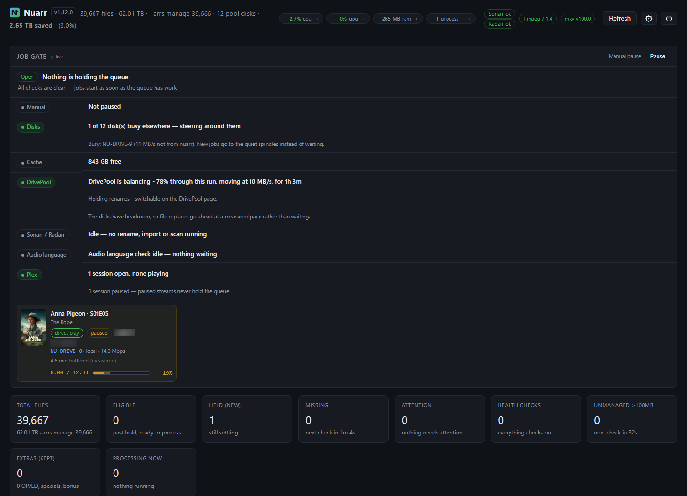
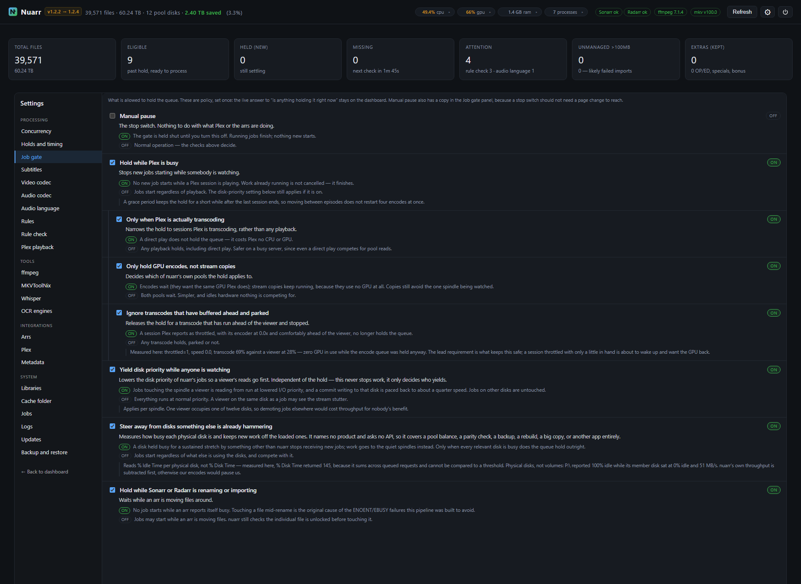
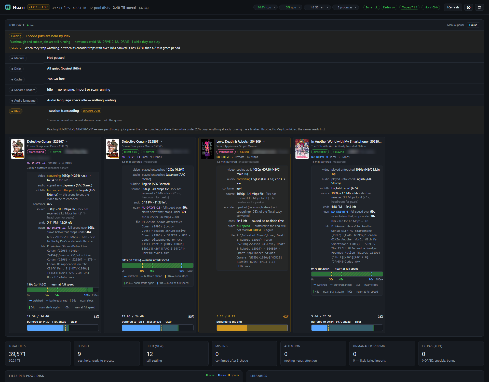
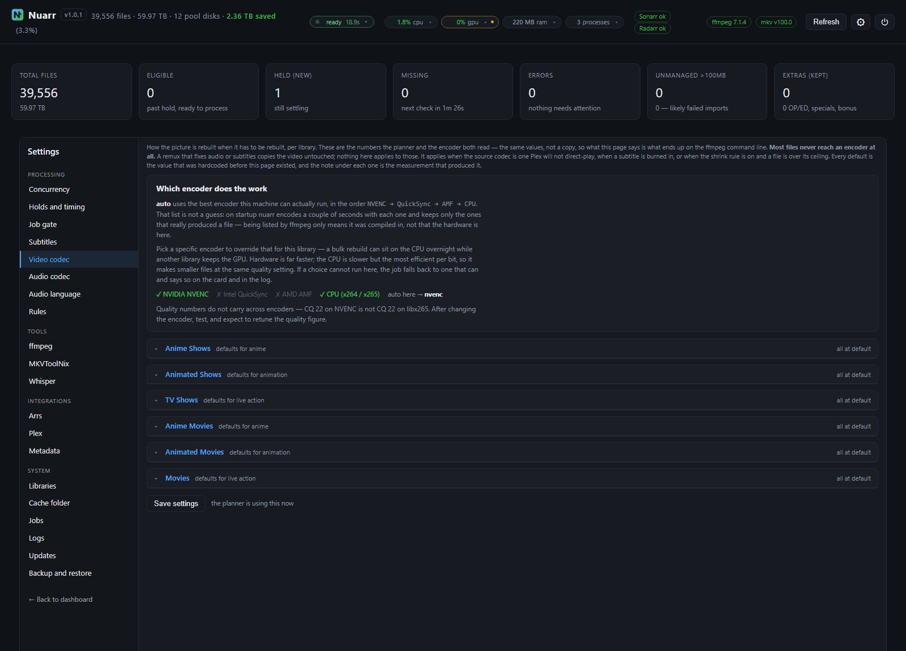
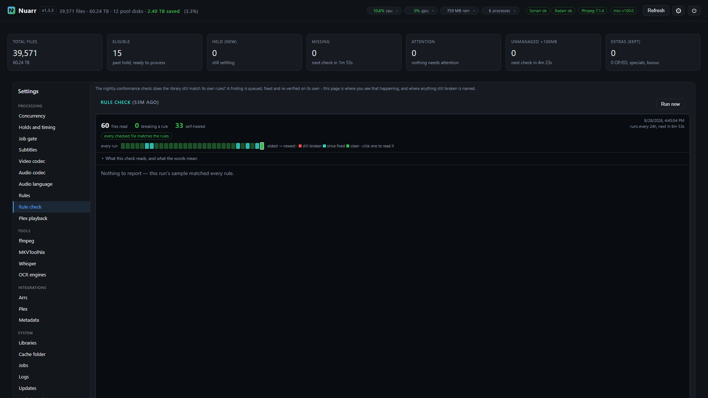

# nuarr

[](https://github.com/NuGundam/nuarr/releases/latest)
[](https://github.com/NuGundam/nuarr/releases/latest)
[](https://github.com/NuGundam/nuarr/releases)
[](https://github.com/NuGundam/nuarr/commits)
[](LICENSE)

**Standardise a media library so Plex plays it without transcoding.**

nuarr watches a Plex library, works out which files will make Plex re-encode on
the fly, and rewrites them so it doesn't have to — while getting out of the way
of anyone actually watching.

Native Windows. Python and FastAPI, one scheduled task, a web UI on port 8770.
No Docker, no Node, no service wrapper.

<!-- nuarr:stats -->
Running against a 12-disk pool: **39,622 files, 61.38 TB, 2.57 TB saved (3.1%).**

<sub>Figures from the 1.11.2 build. The badges above come straight from GitHub and are always current.</sub>
<!-- /nuarr:stats -->

**[▶ Interactive presentation](https://nugundam.github.io/nuarr/presentation.html)** —
a guided tour of the whole system with animated session cards and live-styled
panels, no install needed.



---

## Why it exists

A Plex transcode is usually avoidable. It happens because one thing about a
file is wrong for the client — a subtitle format that forces a burn-in, an
audio codec a TV cannot decode, a container it will not seek in — and the whole
video gets re-encoded to fix it. Standardise those few things ahead of time and
the same file direct-plays.

Doing that across 40,000 files raises a second problem, which is most of what
nuarr is: **converting a library and streaming from it compete for the same
disks.** A tool that fixes your library by making it stutter while it works has
not helped.

## What makes it different

Most of the engineering here is in *not being noticed*.

### It knows how much buffer each viewer actually has

Not "is someone watching" — how many seconds they have banked, per session,
against a floor computed for that stream: scaled by its bitrate, capped under
what that client has been observed to hold, and capped again under Plex's own
`TranscoderThrottleBuffer`. A viewer four minutes ahead is not the same as one
four seconds ahead, and nuarr treats them differently.



Click any session card and all of them open: what Plex did to every track and
why, what the file actually is, how far ahead the viewer is buffered, and —
per disk — the speed nuarr is allowed while they watch.



### It yields the exact spindle being read

Per-disk, not per-pool. One viewer occupies one of twelve disks; work continues
at full speed on the other eleven. On the disk being read, nuarr lowers its I/O
priority, paces its file copies, and — below the floor — suspends the encode
outright and gives the disk back.

### Everything is hysteretic

Pausing an encode is *what makes a viewer's buffer recover*, so a single
threshold oscillates: it pauses, the buffer recovers, it resumes, the buffer
drops, forever. Every decision here has separate stop and start points and a
dwell time. Measured: 36 state changes an hour became 2.

### It states its reasoning

Every hold says what is holding it, what number it is waiting on, and what will
clear it. If nuarr is slowing down, the panel tells you which viewer, on which
disk, with how much buffer, and at what speed nuarr is running as a result.

---

## What it does to files

Configurable per library and per content kind — anime, animation and live
action are not the same problem.

| | |
|---|---|
| **Video** | Re-encode only when the codec or profile forces a transcode. NVENC / QSV / AMF / CPU, probed by test-encode rather than trusted from `ffmpeg -encoders` |
| **Audio** | Keep what plays, transcode what doesn't, drop what nobody needs |
| **Subtitles** | Convert forced PGS to SRT by OCR so it stops forcing a video burn-in |
| **Language tags** | Detect mislabelled audio with Whisper and fix the tag with `mkvpropedit` — metadata only, no re-encode |
| **Containers** | Remux to a container Plex will seek in |



Nothing is deleted. Replacements go through a staged copy that is verified
before the original is moved to the Recycle Bin.

### Rules, and a check that they held

Every file is checked against the rules it was supposed to satisfy, and the
check self-heals: a finding is queued, fixed, and re-verified.



---

## Custom arrs scripts

Optional jobs under **Settings → Arrs** that keep something in Radarr or Sonarr
the way you decided it. Each is off until you turn it on, and each works only
on names you list — nothing here touches a profile or format you have not
named.

### TRaSH anime format sync

The anime custom formats most people run come from the
[TRaSH Guides](https://trash-guides.info/), and they drift: a regex gets
tightened, a release group is re-tiered, a new fansub group appears. The
guides update; your Radarr does not. Nothing tells you, because a format that
has silently stopped matching looks exactly like one that matches nothing this
week.

This reads the current anime formats from the guides and compares them with
what your arrs actually have:

- **Formats you already run are kept current.** If the guides changed a
  format's matching rules, nuarr updates yours to match and names it in the
  log. It never deletes, and it never edits a quality profile.
- **Formats you do not have are reported**, arr by arr — "in the guides, not
  in your arrs". You can tick the ones you want and press **Add ticked to the
  arrs**, or turn on **auto-add** and let each sync bring them in.
- **Added formats carry no score and join no profile.** An unscored custom
  format changes nothing about what gets downloaded until you score it
  yourself, which is what makes adding one safe to automate at all. The
  guides' own recommended scores are deliberately not applied — what a release
  is worth to *your* library is your decision, not theirs.
- **You choose the scope.** Leave the list empty to keep every anime format
  you already have in step with the guides, or name specific formats to track
  just those. Either way you still get told what is new.

It runs at most once a day. That is a limit on someone else's bandwidth, not a
performance trade.

### 2160p profile split guard

If you have built a 2160p profile as two ordered quality groups — resolution
first, custom-format score second — and something rebuilds it flat, this puts
it back and says so. Written for Profilarr, whose profile sync legitimately
owns the shape of a profile and will overwrite yours with its own. List the
profiles to protect per arr; it checks them on a timer and only acts on the
merged shape.

---

## Requirements

- Windows 10 / 11 / Server 2019+
- Python 3.13 — the installer bundles it if missing
- ffmpeg — bundled
- MKVToolNix command-line tools (`mkvmerge`, `mkvpropedit`, `mkvextract`) —
  bundled; an existing MKVToolNix install is used instead if present
- Plex
- **Sonarr and/or Radarr — at least one is required.** nuarr's imports,
  renames and library bookkeeping run through them; installed without one it
  looks fine and then quietly cannot keep the library consistent, so Setup
  insists on a working connection to at least one
- A scratch directory on fast local storage, off the pool

A GPU is optional. nuarr probes what the machine can actually do by
test-encoding two seconds with each encoder family, because `ffmpeg -encoders`
lists what was compiled in, not what works — a build will happily advertise
QSV and AMF on a box with only an NVIDIA card.

Whisper (audio language detection) is optional too, and installs later with
one click from `Settings → Whisper` — GPU or CPU. Without it, untagged audio
is still named by inference; with it, nuarr writes what the track actually
contains.

## Install

Download the installer from [Releases](../../releases) and run it — one exe,
double-click, UAC prompt, wizard. Setup installs Python and the MKVToolNix
command-line tools if the machine lacks them, places its own ffmpeg build,
detects Sonarr / Radarr / Plex where it can (detected credentials are used
silently, never displayed), and tests every connection before it continues.
For Plex there is also **Sign in with Plex** — a small plex.tv window, the
same flow Tautulli uses: sign in there and nuarr receives a token and finds
your server on its own, URL included. Your password goes to plex.tv, never to
nuarr. The same button lives in `Settings → Plex` after install.

nuarr registers in **Programs and Features**, so uninstalling works from
Windows Settings like any other application. The uninstaller removes the
program, scheduled task, shortcut, cache and network connections; it keeps
your **database** by default so reinstalling picks the library back up, and it
never touches media — if the cache folder unexpectedly contains video, it
refuses and tells you to look yourself.

## Storage

nuarr indexes three kinds of storage, and is honest about what each can do:

| | |
|---|---|
| **StableBit DrivePool** | The full experience: files are attributed to the physical spindle they live on, so nuarr yields the exact disk a viewer is reading, orders scans quietest-disk-first, and shows per-disk load |
| **Plain folders** | `C:\Movies` on any machine works — files are tracked per drive, with real capacity and free-space figures |
| **Network shares** | nuarr connects to SMB shares **as the service**, with credentials you give it once (Browse → "Connect a network share"). It reconnects after reboots. Per-spindle intelligence degrades to per-share, because that is all SMB exposes |

A note on mapped drives: `P:\` mapped in your login session is invisible to a
service — that is Windows, not nuarr. Use the UNC path
(`\\server\share\...`); the picker walks connected servers and their shares.

## From source

```
git clone https://github.com/NuGundam/nuarr
cd nuarr
pip install -r requirements.txt
copy config.example.yml config.yml    # then edit it
python launch.py
```

Then open <http://127.0.0.1:8770>.

## Configuration

`config.yml` holds the libraries, the arr connections and the Plex details.
Everything else is in the UI under Settings, and takes effect without a
restart.

**`config.yml` is gitignored.** It holds your Plex token and API keys. Do not
commit it.

---

## Updates

nuarr shows its version beside its name and follows this repository's
[Releases](../../releases) out of the box. From 1.0.3 it updates itself: the
badge in the header walks through *update available → downloading → ready to
install*, and installing — from the power menu or `Settings → System →
Updates` — downloads the release installer, verifies it byte-for-byte against
GitHub's published size, stages the new program files, then restarts nuarr for
a few seconds while a helper swaps them and brings it back. Your database and
config are untouched.

Two modes. **Manual** (the default) tells you and waits. **Auto** also does the
download-and-verify step on its own — but only after ten unbroken minutes of
idle, meaning no jobs running and nobody watching Plex, so the fetch never
competes with a viewer for I/O. Installing is *always* your click in either
mode, because nuarr is usually mid-encode and swapping its own files under a
running ffmpeg is the one outcome the whole system exists to prevent.

Under `Settings → System → Updates` you can point it at a fork to follow a
different build, or type `off` and it never contacts GitHub.

## Status

Built for one library and one server, then hardened by
installing it somewhere else: the installer and app have been through repeated
clean-VM installs, which is where most of the sharp edges listed in the commit
history were found and filed off. The primary deployment remains a 12-disk
StableBit pool with Plex, Sonarr and Radarr on the same machine; interfaces it
depends on — Plex's session fields, DrivePool's placement — are read
defensively, but a setup unlike that one may still find edges.

The version above is whatever GitHub last published — this page does not
carry a copy of it, because a copy is only right until the next release.

Bug reports with the relevant lines from `Settings → Logs` are welcome.

## Licence

MIT. See [LICENSE](LICENSE).
